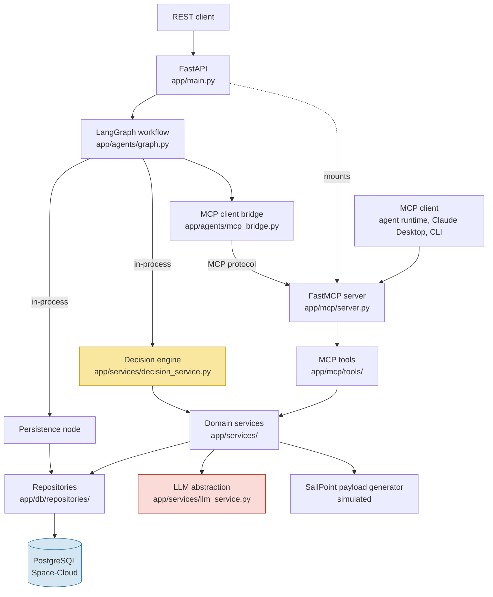
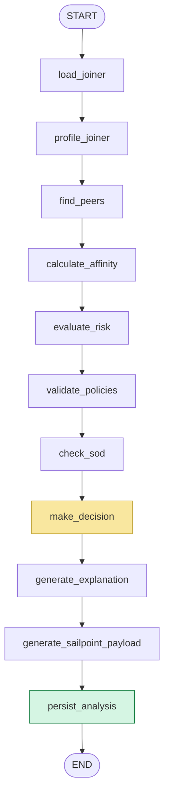
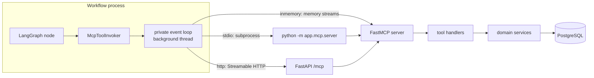
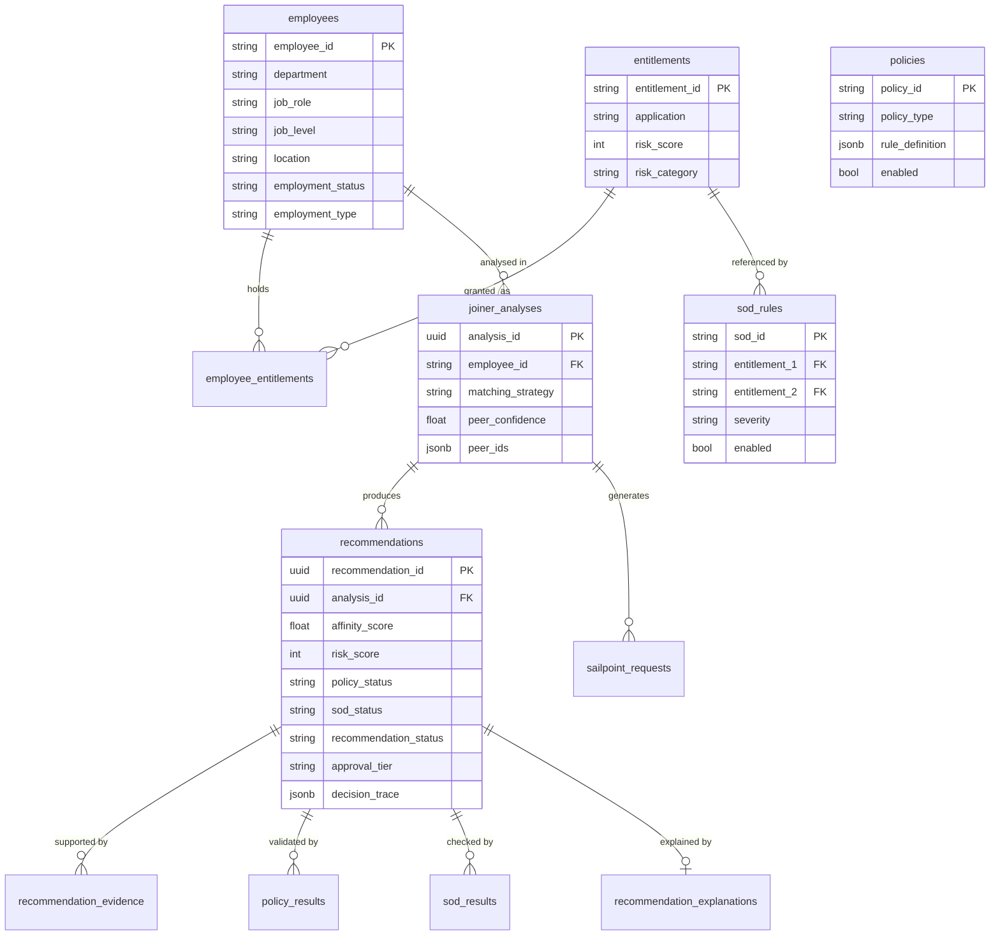
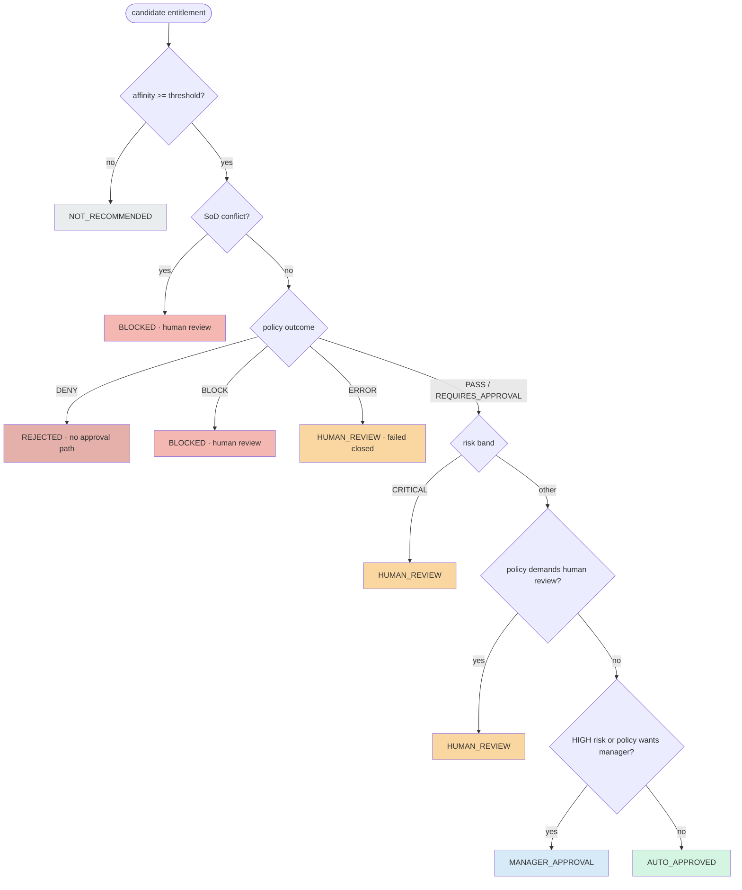
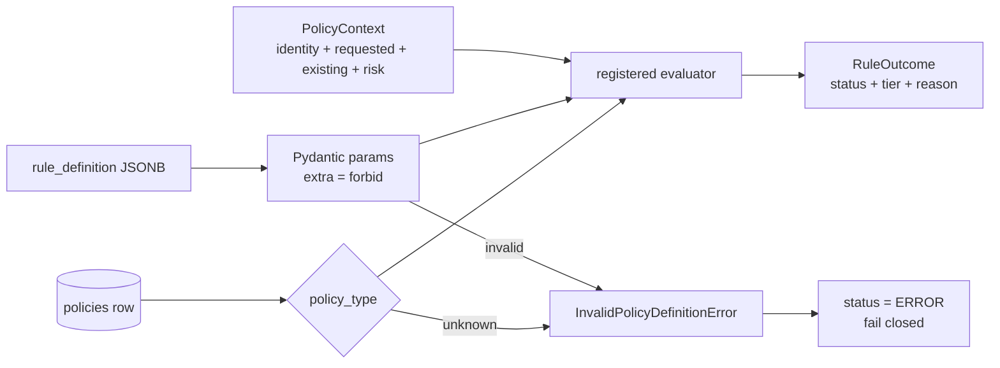
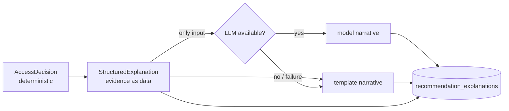
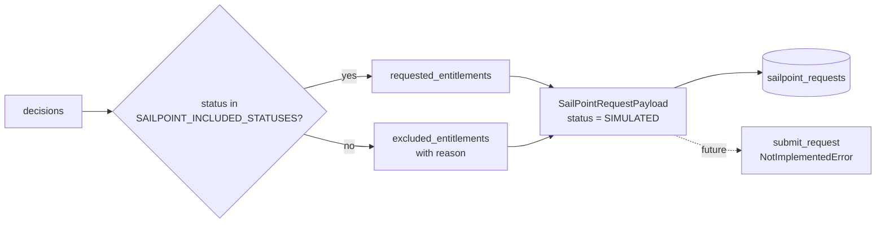
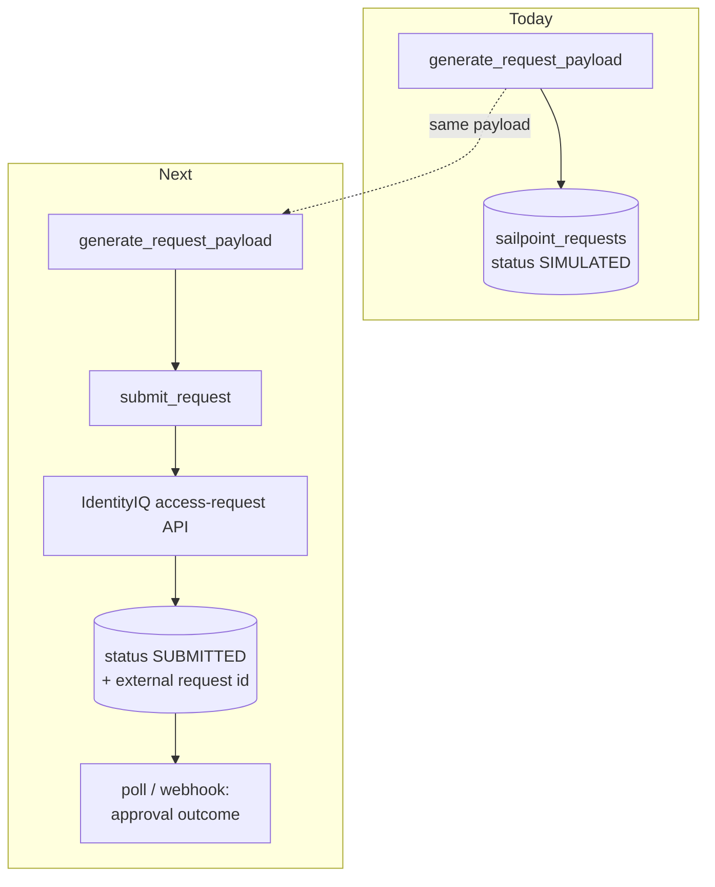
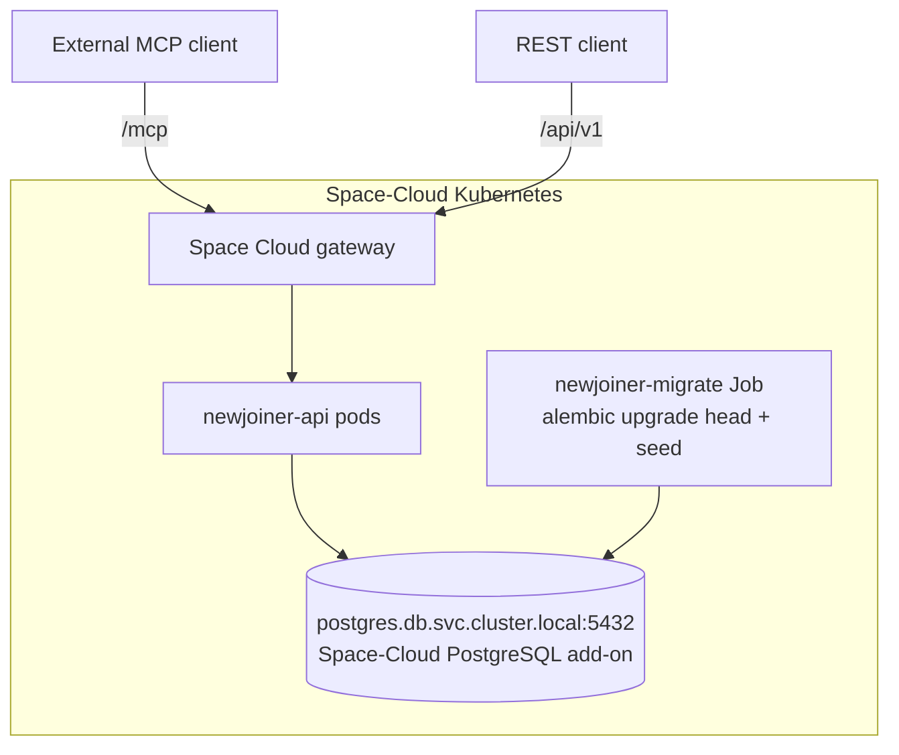

# Architecture

## 1. What this system is

An AI-assisted identity governance service that answers one question for a new
joiner: **which application entitlements should this person receive?**

It answers it by looking at what comparable employees already hold, then
subjecting every candidate entitlement to the same controls a human access
reviewer would apply — risk banding, policy validation and segregation of
duties — before producing an explainable decision and a SailPoint
IdentityIQ-style access request.

The central design commitment is stated once here and enforced everywhere
below:

> **The LLM never decides anything.** Affinity, risk classification, policy
> outcomes, SoD detection, approval tier and the final recommendation status
> are computed by deterministic rules over database state. The model layer
> converts that structured evidence into prose. Nothing else.

---

## 2. System architecture



---

## 3. Component responsibilities

| Layer | Location | Responsibility | Must not |
|---|---|---|---|
| REST API | `app/api/`, `app/main.py` | HTTP contract, validation, error mapping, correlation ids | Contain business rules |
| MCP server | `app/mcp/` | Expose domain capabilities as MCP tools | Contain business rules |
| Workflow | `app/agents/` | Sequence the analysis, thread typed state, call MCP tools | Talk HTTP; write SQL |
| Domain services | `app/services/` | **All governance logic** | Import FastAPI or LangGraph |
| Domain models/rules | `app/domain/` | Vocabulary, typed models, policy evaluators | Touch the database |
| Repositories | `app/db/repositories/` | Every SQL statement in the system | Make decisions |
| Config/logging | `app/config.py`, `app/logging.py` | Environment-driven settings, structured logs | Hold secrets in source |

The rule that keeps this honest: **REST and MCP are two transports over one
service layer.** `app/api/routes/joiners.py` and `app/mcp/tools/identity_tools.py`
both call `PeerAnalysisService`. Neither reimplements it.

---

## 4. The analysis workflow



Yellow = the governance kernel (in-process). Green = the single persistence
transaction. Every other node reaches its capability through an MCP tool call.

The graph is linear because the governance sequence is linear: affinity needs
peers, and the decision needs risk, policy and SoD to have all reported.

### State

`app/agents/state.py` defines `AccessRecommendationState` as a `TypedDict` of
**validated Pydantic models**, not loose dictionaries. Data returned across the
MCP boundary arrives as JSON and is re-validated into the same model the
service produced, so a malformed tool response fails at the node that received
it rather than three nodes later.

`errors`, `steps_completed` and `mcp_tool_calls` use an append reducer, so a
late failure never erases the record of an earlier one.

### Failure policy

| Node | On failure |
|---|---|
| `load_joiner` | Fatal. Without an identity there is nothing to analyse and nothing that could be persisted against a foreign key. |
| every other node | Records the error on state and continues, so everything already established still reaches the database. |

This is what delivers the requirement that **a failed explanation must not make
the governance decision disappear**. It is enforced at two levels: the
explanation service falls back to a deterministic template when the model
fails, and the node wrapper tolerates an outright crash of the whole step.
`tests/integration/test_workflow.py::test_explanation_failure_does_not_lose_the_decisions`
asserts both.

---

## 5. MCP architecture



### Why a bridge exists

The workflow nodes are synchronous — they ultimately hit a synchronous
SQLAlchemy session — while the MCP client is asynchronous.
`app/agents/mcp_bridge.py` owns that boundary: it runs a private event loop on
a background thread and keeps **one MCP session open for the whole workflow
run**, so an eleven-node analysis performs one protocol handshake rather than
eight.

### The four modes, and the tradeoff

| Mode | Transport | Used by |
|---|---|---|
| `inmemory` *(default)* | Real MCP client/server session over in-process memory streams | REST API path |
| `stdio` | Real MCP client spawning `python -m app.mcp.server` as a subprocess | Demo script, MCP integration tests |
| `http` | Real MCP client against a running Streamable-HTTP server | Distributed deployments |
| `direct` | No MCP; calls the tool handler in process | `run_access_analysis` only |

**The tradeoff, stated plainly.** `inmemory` is the default for the API path
because spawning a subprocess — and with it a second database connection pool —
on every analysis costs seconds and buys nothing when the tools live in the
same deployable. It is still the MCP protocol end to end: the client
initialises a session, negotiates capabilities and exchanges JSON-RPC messages;
it simply does so without a socket. `stdio` exercises the out-of-process path
and is what the demo and `tests/test_mcp.py::test_stdio_transport_works` use,
so the cross-process contract is covered rather than assumed.

`direct` exists for exactly one reason: `run_access_analysis` is itself an MCP
tool, and a tool handler must not re-enter the transport currently serving it.

### One handler, two transports

Tool handlers are **module-level functions**, not closures built inside a
`register()` call:

```python
# app/mcp/tools/identity_tools.py
@mcp_tool_handler
def find_peer_employees(employee_id: str) -> PeerAnalysisResult:
    with tool_session() as session:
        return PeerAnalysisService(session).find_peers(employee_id)

HANDLERS = {"find_peer_employees": find_peer_employees, ...}
```

`app/mcp/tools/__init__.py` merges every module's `HANDLERS` into
`ALL_HANDLERS`. The MCP server wraps them in the protocol; `direct` mode calls
the identical function object. That is what makes "MCP tools are thin wrappers
over the domain services" checkable rather than aspirational.

### Errors across the boundary

MCP flattens exceptions to strings. The handler prefixes every domain failure
with its code (`"employee_not_found: ..."`), and `_translate_error` in the
bridge rebuilds the original exception type on the client side. Without this, a
missing employee reaching the API through the workflow would surface as a
gateway error instead of a 404 — `tests/integration/test_api.py::test_analyzing_an_unknown_joiner_returns_404`
pins that behaviour.

---

## 6. Data model



### Deliberate schema choices

- **`recommendations.analysis_id`** — the original specification wrote this
  column as `analysis_idx`. It is a foreign key to
  `joiner_analyses.analysis_id`, so it carries that name here.
- **`employees.employment_type`** — added alongside `employment_status`. Status
  is a lifecycle state (`ACTIVE`, `PENDING_START`, `TERMINATED`); type is the
  contract form (`EMPLOYEE`, `CONTRACTOR`). The contractor restriction policy
  needs the latter, and overloading the former would have made "is this person
  employed?" and "how are they employed?" the same column.
- **`recommendation_explanations`** — a table the original schema did not list.
  The requirement to persist *both* the structured explanation and the
  generated narrative needs somewhere to put them, and keeping them together is
  what makes the prose auditable: you can always check it against the facts it
  was generated from.
- **JSONB is used for** policy rule parameters, decision traces, peer id lists,
  structured explanations and SailPoint payloads — all ordered or
  schema-flexible blobs read back whole. Everything queried or aggregated
  (statuses, scores, tiers, strategies) is a real column with an index.

---

## 7. Decision flow



Precedence is the point. Reading it in order:

1. **Affinity gates everything.** Below threshold, nothing else is even
   evaluated — there is no proposal to govern.
2. **SoD outranks policy and risk.** A toxic combination is a structural
   problem with the *set* of access, not a property of one entitlement.
3. **DENY is terminal; BLOCK is reviewable.** A contractor barred from
   sensitive data is `REJECTED` with no approval path. A policy block goes to
   `HUMAN_REVIEW` where a person can weigh it.
4. **ERROR fails closed.** A control that could not be evaluated becomes
   `HUMAN_REVIEW`, never a silent pass. A broken control must not look like a
   satisfied one.

`decide()` is a pure function: no I/O, no model calls, same inputs → same
output. `tests/unit/test_decision.py` states each of these rules as an
assertion.

### Where each input comes from

| Input | Source | Determinism |
|---|---|---|
| Affinity | `(peers holding / total peers) × 100` | Recomputable by counting rows |
| Risk | `entitlements.risk_score` → configured bands | Catalogue lookup |
| Policy | Registered evaluators over `rule_definition` parameters | No expression evaluation anywhere |
| SoD | Enabled `sod_rules` against requested ∪ existing access | Set intersection |

---

## 8. Policy engine

There is no generic rule interpreter. Each `policy_type` maps to a hand-written
evaluator with a Pydantic parameter model:



`rule_definition` supplies **parameters only**. It is never compiled, `eval`-ed
or otherwise executed, and `extra="forbid"` means an unrecognised key in a rule
definition is rejected rather than ignored. Adding a policy type means writing
an evaluator and registering it — deliberate friction, because a governance
control should be reviewable code rather than a string in a database.

Supported types: `MUTUALLY_EXCLUSIVE_ENTITLEMENTS`, `RISK_THRESHOLD_APPROVAL`,
`EMPLOYMENT_TYPE_RESTRICTION`, `LOCATION_RESTRICTION`, `JOB_LEVEL_RESTRICTION`,
`DEPARTMENT_RESTRICTION`.

---

## 9. Peer analysis

Strategies are tried in order of decreasing precision, stopping at the first
that yields anyone:

```
job_role + department + job_level   base confidence 0.95
        ↓ (none found)
job_role + department               base confidence 0.85
        ↓
department + job_level              base confidence 0.70
        ↓
department                          base confidence 0.55
        ↓
NONE — no recommendations from peer evidence
```

The strategy that produced the group is recorded on the analysis *and on every
recommendation*, because a recommendation derived from a department-wide match
is a much weaker claim than one from an exact role match, and the audit trail
has to say which it was.

```
confidence = base(strategy) × (0.6 + 0.4 × min(1, peer_count / saturation))
```

Group size matters as well as precision: a single peer is evidence of almost
nothing, and beyond the saturation point (default 8) more peers add little.

Only `ACTIVE` identities are ever selected. Leavers and not-yet-started joiners
are excluded — the seed data deliberately gives two terminated employees toxic
privileged access, so any regression in that filter surfaces immediately as
candidate entitlements.

When no strategy matches, the result says so and no entitlements are
recommended. Unrelated employees are never silently substituted.

---

## 10. Explainability

Two artefacts per recommendation, both persisted:



The structured form is built deterministically from the decision record and is
the **only** thing the model ever sees. The narrative is prose about a decision
that has already been made.

The system prompt forbids introducing facts, but the architecture does not rely
on the model obeying it: `generate_narrative` returns a *string*, and every
decision field on the stored explanation is copied from the deterministic
result. `tests/unit/test_explanation.py::test_llm_prose_cannot_change_the_decision`
feeds in a model that fabricates a contradictory verdict and asserts the
decision is unchanged.

---

## 11. SailPoint integration (simulated)

**No SailPoint environment is contacted.** `SailPointService` builds the payload
an IdentityIQ connector would submit, marks it `SIMULATED`, and persists it.



Default inclusion is `AUTO_APPROVED` and `MANAGER_APPROVAL` — items SailPoint
can route for approval. Blocked, rejected, review-pending and not-recommended
entitlements are listed under `excluded_entitlements` **with their reason**, so
the exclusion is auditable rather than invisible.

`submit_request()` raises `NotImplementedError` rather than returning a fake
success. A stub that lies about provisioning is worse than no stub. It is the
seam a real connector drops into.

---

## 12. Observability

Every log line carries `correlation_id`, `analysis_id`, `employee_id` and
`workflow_step`, merged automatically from context variables so no call site
has to remember to pass them. Logged events include workflow start/end, each
step boundary, every MCP tool invocation, peer matching, affinity, risk, policy,
SoD, the final decision, payload generation and persistence.

`_redact_processor` blanks anything key-named like a secret, and the database
URL is redacted at source by `Settings.safe_database_url()`. Logs go to
**stderr**, which is what keeps the stdio MCP transport usable — stdout there
is the JSON-RPC channel.

---

## 13. Future SailPoint integration



What is already in place for it: the `SailPointRequestStatus` enum carries
`SUBMITTED` and `FAILED`; `sailpoint_requests` stores the payload as JSONB
alongside a status column; and `submit_request()` exists as an explicit seam.
What a real connector adds is authentication, the HTTP call, retry/idempotency
handling, and reconciliation of approval outcomes back onto the recommendation
rows.

---

## 14. Deployment



Migrations run as a one-shot Job rather than on pod start: with more than one
replica, every replica would race to migrate. `RUN_MIGRATIONS` defaults to
`false` for exactly that reason.

Configuration is entirely environment-driven, so the same image runs against a
local PostgreSQL container and the Space-Cloud add-on with no code change. See
[`space-cloud-deployment.md`](space-cloud-deployment.md).
